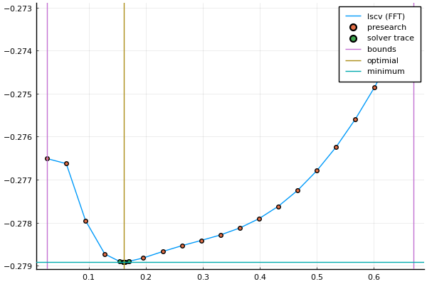
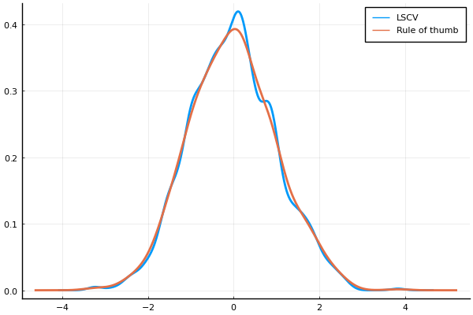

# KDEstimation (Kernel Density Estimation)
[](https://travis-ci.com/m-wells/KDEstimation.jl)
[](https://codecov.io/gh/m-wells/KDEstimation.jl)
[](https://coveralls.io/github/m-wells/KDEstimation.jl?branch=master)

The purpose of this package is to provide a general framework for implementing Kernel Density Estimation methods.

## Univariate KDE
The density estimator


where

*  is the estimator
*  is the kernel function
*  is the bandwidth
can be evaluated using one of three implemented methods.
* `Direct()` 
  *  where  is the sample size
* `Binned()`
  *  where  is the number of evaluation points
  *  by default
* `FFT()`
  *  where  is the number of evaluation points
  *  by default

## Multivariate KDE (work in progress)

## Kernels implemented
Here is a link to the [relevant wikipedia article](https://en.wikipedia.org/wiki/Kernel_(statistics)#Kernel_functions_in_common_use)

| Kernel           | $K(u)$                                                  | Support    |
|------------------|---------------------------------------------------------|------------|
|Biweight          |                       |  |
|Cosine            |           |  |
|Epanechnikov      |                                      |  |
|Logistic          |                         | unbounded                                                                             |
|Normal            |  | unbounded                                                                             |
|SymTriangularDist |                            |  |
|Triweight         |                                  |  |
|Uniform           |                                             |  |

This package uses [Distributions.jl](https://github.com/JuliaStats/Distributions.jl) to suppy kernels such that


where   and ) is one of the kernels listed in the table above.

__Note:__ for the Uniform distribution, [Distributions.jl](https://github.com/JuliaStats/Distributions.jl) defines `(loc,scale) = (a, b-a))` where `a` and `b` are the bounds lower and upper bounds, respectively.
This package accounts for this inconsistancy by evaluating the Uniform kernel as .

## Bandwidth selection via Least Squares Cross Validation
The objective function to minimize is given by


where


This has also been implemented using `Direct`, `Binned`, and `FFT` methods.

# Example usage


```julia
using KDEstimation, Distributions
# set a seed for reproducibility
using Random: seed!
seed!(1234)
# generate random data
x = randn(1000)
rot = rule_of_thumb2(Normal,x)
println("rule of thumb: ", rot)
lscv_res = lscv(Normal,x,FFT())
```

    ┌ Info: Precompiling KDEstimation [c13e3d18-d57b-11e9-0f19-037e2db2dfef]
    └ @ Base loading.jl:1317


    rule of thumb: 0.2676817928332638


    LSCV{Normal,FFT(4096),1}
    Results of Optimization Algorithm
     * Algorithm: Golden Section Search
     * Search Interval: [0.128205, 0.195830]
     * Minimizer: 1.616402e-01
     * Minimum: -2.789090e-01
     * Iterations: 34
     * Convergence: max(|x - x_upper|, |x - x_lower|) <= 2*(1.5e-08*|x|+2.2e-16): true
     * Objective Function Calls: 35


# Visualization using [`Plots.jl`](https://github.com/JuliaPlots/PlotDocs.jl)


```julia
using Plots; pyplot()
plot(lscv_res)
```


    

    


```julia
h = minimizer(lscv_res)
fkde = kde(Normal, h, x, FFT())
frot = kde(Normal, rot, x, FFT())
# these can be called like functions
@show fkde(0.3)
@show frot(-2)
;
```

    fkde(0.3) = 0.37927382397190534
    frot(-2) = 0.05601509471009895


```julia
plot(fkde, label="LSCV", lw=2)
plot!(frot, label="Rule of thumb", lw=2)
```


    

    


# Further Reading
This work has been heavily influenced by Artur Gramacki's book "Nonparametric Kernel Density Estimation and Its Computational Aspects" 
