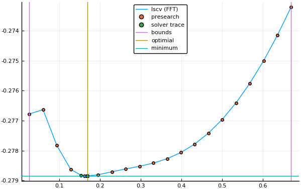
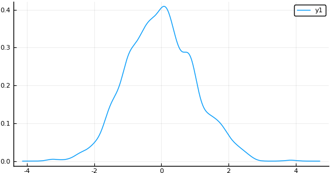

# KDEstimation (Kernel Density Estimation)

The purpose of this package is to provide a general framework for implementing Kernel Density Estimation methods.

## Univariate KDE
The density estimator

=\frac{1}{n}\sum_{i=1}^nK\left(\frac{x-x_i}{h}\right))

where

* ) is the estimator
* ) is the kernel function
*  is the bandwidth

can be evaluated using one of three implemented methods.

* `Direct() # O(N^2) where N is the sample size`
* `Binned() # O(M^2) where M is the number of evaluation points (M=4096 by default)`
* `Direct() # O(MlogM) where M is the number of evaluation points (M=4096 by default)`

## Multivariate KDE (work in progress)

## Kernels implemented
Here is a link to the [relevant wikipedia article](https://en.wikipedia.org/wiki/Kernel_(statistics)#Kernel_functions_in_common_use)
<table>
    <tr>
        <th>Kernel</th>
        <th></th>
        <th>Support</th>
    </tr>
    <tr>
        <td>Biweight</td>
        <td></td>
        <td></td>
    </tr>
    <tr>
        <td>Cosine</td>
        <td></td>
        <td></td>
    </tr>
    <tr>
        <td>Epanechnikov</td>
        <td></td>
        <td></td>
    </tr>
    <tr>
        <td>Logistic</td>
        <td></td>
        <td></td>
    </tr>
    <tr>
        <td>Normal</td>
        <td></td>
        <td></td>
    </tr>
    <tr>
        <td>SymTriangularDist</td>
        <td></td>
        <td></td>
    </tr>
    <tr>
        <td>Triweight</td>
        <td></td>
        <td> </td>
    <tr>
        <td>Uniform</td>
        <td></td>
        <td></td>
    </tr>
</table>

This package uses [Distributions.jl](https://github.com/JuliaStats/Distributions.jl) to suppy kernels such that =\textnormal{pdf}(D(x_i,h),x)) where =\tfrac{1}{h}K(\tfrac{u}{h})) and  is one of the kernels listed in the table above.

__Note:__ for the Uniform distribution, [Distributions.jl](https://github.com/JuliaStats/Distributions.jl) defines `(loc,scale) = (a, b-a))` where `a` and `b` are the bounds lower and upper bounds, respectively.
This package accounts for this inconsistancy by evaluating the Uniform kernel as ,x))

## Bandwidth selection via Least Squares Cross Validation
The objective function to minimize is given by

=\int\hat{f}^2_h(x)dx-2\frac{1}{n}\sum_i\hat{f}_{h,-i}(X_i))

where

=\frac{1}{(n-1)h}\sum_{j\ne&space;i}K\left(\frac{X_i-X_j}{h}&space;\right&space;))

This has also been implemented using `Direct`, `Binned`, and `FFT` methods.

# Example usage

    julia> using KDEstimation, Distributions

    # generate random data
    julia> using Random: seed!

    julia> seed!(1234);

    julia> x = randn(1000);

    julia> lscv_res = lscv(Normal,x,FFT())
    LSCV{Normal,FFT(4096),1}
    Results of Optimization Algorithm
     * Algorithm: Golden Section Search
     * Search Interval: [0.128239, 0.195882]
     * Minimizer: 1.688927e-01
     * Minimum: -2.788450e-01
     * Iterations: 34
     * Convergence: max(|x - x_upper|, |x - x_lower|) <= 2*(1.5e-08*|x|+2.2e-16): true
     * Objective Function Calls: 35

    julia> using Plots; pyplot()

    julia> plot(lscv_res)
    

    
    julia> h = minimizer(lscv_res)
    0.16761124952746273

    julia> fkde = kde(Normal, h, x, FFT())
    KDE via FFT Evaluation Method (4096 bins)
      Kernel: Normal
      Bandwidth: 0.16761124952746273

    julia> fkde(0.3)
    0.3694698807401497

    julia> plot(fkde)

# Visualization using `Plots.jl`

# Further Reading
This work has been heavily influenced by Artur Gramacki's book "Nonparametric Kernel Density Estimation and Its Computational Aspects" 
